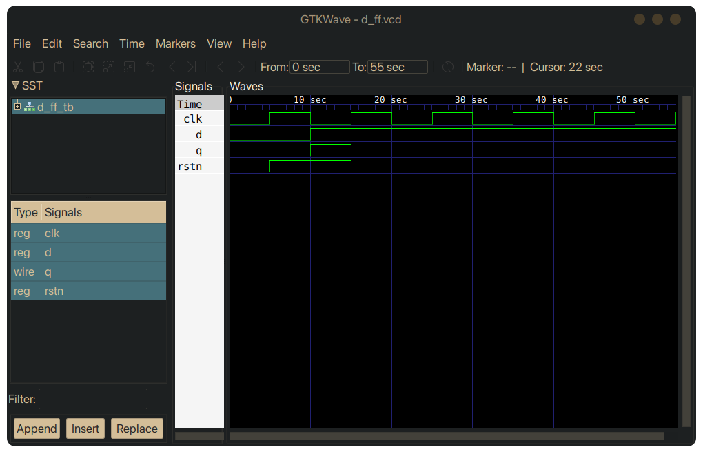
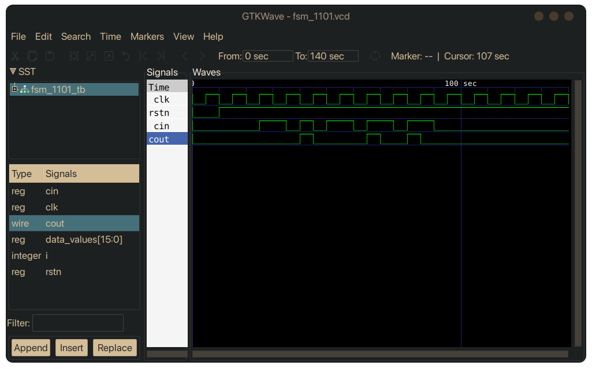

# My Verilog Basic Projects
I've been familirising with verilog basics and now I felt the need to improve my skills by designing some basic circuits. This repo includes verilog code along with the testbench and the ouput waveforms of the projects I've done so far.

## Projects done so far

<ol> <b>
  <li style="font-weight: bold;">Inverter</li>
  
  <li>Full Adder</li>
   
  <li>3 Bit Counter</li>
  
  <li>D FlipFlop</li>
  
  <li>FSM 1101 Detector</li>
  
</b> </ol>
